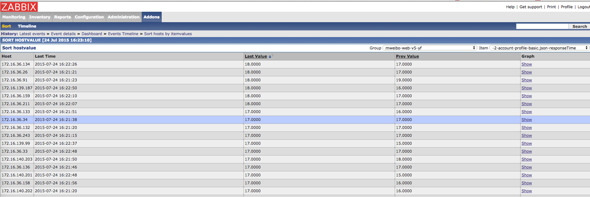

# Zabbix Web Sort Plugin

zabbix-web 一直以来对 hostgroup 的数据没有一个完善的查询展示方式。**Screen** 页只能显示有限的一些重要资源的汇总情况。**Latest Data** 页只能查看单机性能数据情况。

南非蜘蛛开源有一个 zabbix-web 插件叫 [zatree](https://github.com/spide4k/zatree)。该插件学习 ganglia-web 的组织方式，将 hostgroup 下全部 graph 展示在一个页面内方便查看。但是由于 zabbix 所有数据来自 MySQL，在监控项较多的情况下，SQL 压力很容易导致 zabbix-web 直接无响应。同时，过多的图片也并不适合快速比对。

对此，设计了 sort 插件。其作用是，对选定的 hostgroup 和 item 项，将所属的 host 及其 last/previous value 以表格的形式排序列出。通过点击表头，对 item value 做升降序排列，方便快速定位影响最大的前几名 host。

本插件尽量复用了 zabbix-web 原有的页面设计和辅助函数，感谢 zabbix！

## 使用方式

复制 `include` 目录，及 `sort.php` 文件，到你的 zabbix-web 发布目录即可。

## 友情提示

1. 代码仅在 zabbix-web-2.2.5 上测试运行通过。不保证其他版本一定正常。
2. 同时使用多个插件时，注意 `include/menu.inc.php` 中可能会相互冲突，请自行合并。

## TODO

目前是从 item 表获取 last value，只能在故障当前排序有效。拟修改成从 history 表获取历史数据，并提供 time filter 功能。
